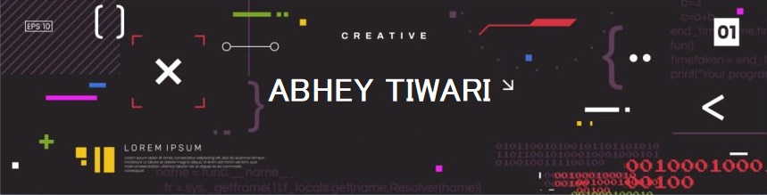

<div align="center">
 
  

  # ABHEY TIWARI
  
  <a href="https://git.io/typing-svg">
    
  </a>

  <p align="center">
    <b>AI Systems Builder</b> • <b>Full-Stack Developer</b> • <b>Privacy-First Engineering</b>
  </p>
  
  <p align="center">
    <i>"Building intelligent systems that work beyond localhost."</i>
  </p>

  <p align="center">
    <a href="https://linkedin.com/in/abheytiwari">
      
    </a>
    &nbsp;
    <a href="https://twitter.com/abhey_tiwari">
      
    </a>
    &nbsp;
    <a href="mailto:abheytiwarikvs@gmail.com">
      
    </a>
    &nbsp;
    <a href="https://abheytiwari.github.io/Portfolio_Website/">
      
    </a>
  </p>
</div>

---

## 🧠 About Me

```python
class AbheyTiwari:
    def __init__(self):
        self.education = "BSc Mathematical Sciences @ Delhi University"
        self.focus = ["Agentic AI", "RAG Systems", "Local LLMs"]
        self.philosophy = "Understanding systems > framework hype"
    
    def stack(self):
        return ["Python", "FastAPI", "Ollama", "FAISS", "Linux VMs"]
    
    def motto(self):
        return "If it breaks in production, I want to know why"
```

**I build privacy-first AI systems that respect user data and perform under pressure.** Whether it's optimizing RAG pipelines for semantic retrieval or deploying bare-metal Linux VMs for production ML, I focus on measurable impact over framework complexity.

<table>
  <tr>
    <td align="center" width="33%">
      <h3>🔬 Research</h3>
      <p>Mathematical modeling for sustainable tech</p>
    </td>
    <td align="center" width="33%">
      <h3>🚀 Production</h3>
      <p>Raw VM deployment & performance optimization</p>
    </td>
    <td align="center" width="33%">
      <h3>🔐 Privacy</h3>
      <p>Local LLM orchestration & edge computing</p>
    </td>
  </tr>
</table>

---

## 🚀 Featured Projects

| **Project** | **What It Does** |
|:---:|:---|
| <br/>**🧠 INDICA v1.0**<br/>*Voice-Controlled Cognitive Assistant* | **Modular agent framework with contextual memory.**<br/>• Dual-layer memory: short-term conversational + long-term semantic embeddings<br/>• Complete voice pipeline (STT → NLU → Skill Execution) with 10+ plugin modules<br/>• **Tech:** `Python` `RAG` `Gemini API` `AsyncIO` `Playwright` |
| <br/>**🛡️ Maitri AI**<br/>*Privacy-First Mental Health Companion* | **Emotional intelligence that never leaves your machine.**<br/>• Real-time emotion detection using DeepFace (100% local)<br/>• Contextual dialogue generation via Ollama<br/>• **Tech:** `FastAPI` `Ollama` `DeepFace` `WebSockets`<br/>• **Impact:** Zero cloud data transmission |
| <br/>**📚 Quizard**<br/>*RAG-Based PDF Q&A* | **Document understanding that actually works.**<br/>• Semantic chunking + vector retrieval for long documents<br/>• Context-aware answers with >90% accuracy on evaluation sets<br/>• **Tech:** `FastAPI` `Streamlit` `Gemini API` `Vector Embeddings` |
| <br/>**🏥 Cancer Detection AI**<br/>*Lightweight Multimodal Diagnostics* | **Healthcare AI for low-resource environments.**<br/>• Hybrid CNN + XGBoost optimized for non-GPU laptops<br/>• MRI & skin-lesion analysis with interpretable predictions<br/>• **Tech:** `TensorFlow` `PyTorch` `XGBoost` |

---

## 💼 Experience

### **Tech, Research & Innovation Intern** | *Draupadi Dream Trust*
*Jul 2025 – Aug 2025*

- Conducted independent research on the Yamuna River (religious, cultural, environmental perspectives)
- Analyzed Delhi Jal Board datasets for urban water issues
- Co-authored website redevelopment plans with technical documentation

### **Frontend Developer (Remote)** | *BeyondRiffs*
*Sept 2024 – Dec 2024*

- Collaborated across frontend (React) and backend (FastAPI) layers
- **25% load time reduction** (measured via Lighthouse before/after optimization)
- **30% faster feature turnaround** with modular microservices architecture
- Focused on performance optimization and API design

### **Website Developer** | *Mangalam Valley Resort*
*Jul 2023 – Nov 2023*

- Delivered booking-enabled website with integrated payments and SSL
- Implemented responsive UX and managed full deployment workflow

---

## 🛠️ Tech Stack

> Tools I've actually used in projects, not just tried once.

<div align="center">

### 🧠 Intelligence Layer


### 🏗️ Application Layer


### ⚙️ Infrastructure & Data


</div>

---

## 🎯 Current Focus

<table>
<tr>
<td width="33%" align="center">

### 🔨 Building
Privacy-first agentic AI with local LLMs

</td>
<td width="33%" align="center">

### 📚 Learning
Advanced RAG architectures & production ML systems

</td>
<td width="33%" align="center">

### 🔬 Researching
📄 Mathematical & biological modeling for sustainable tire waste degradation

</td>
</tr>
</table>

---

<div align="center">

### 💭 Philosophy

*"Understanding systems > framework hype."*

*"If it breaks in production, I want to know why."*

<br/>

<a href="mailto:abheytiwarikvs@gmail.com">
  
</a>

<br/><br/>


</div>
